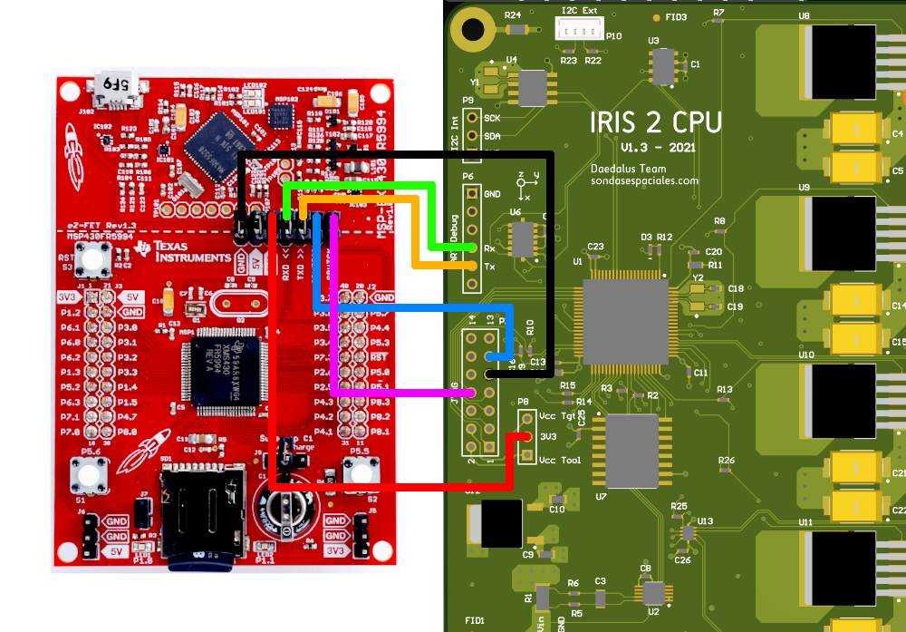
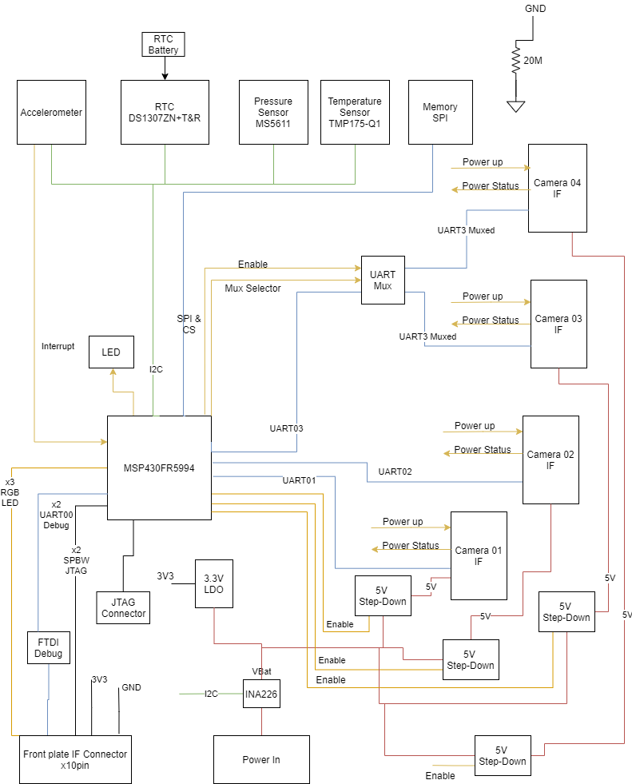

# IRIS2-firmware-flight
Firmware for the IRIS2 CPU, that will fly as an instrument on the mission Sunrise III

## Prerequisites
You should install Code Composer Studio (Version 10 or higher preffered) https://www.ti.com/tool/CCSTUDIO

## Programming the MCU
You should have a programmer for MSP430, a launchpad is enough.
In the docs/ folder you will find all the documents with detailed description and datasheets of the hardware involved.

In order to program the MCU you must connect the following lines:
* GND
* SBWTDIO
* SBWTCK

The following lines are not always needed:
* 3V3, Only if you are not providing external power supply
* RDX, Only if you need access to Front Plate (Command line) UART 
* TXD, Only if you need access to Front Plate (Command line) UART

For easy access :)
<div align="center">

</div>

## Global Overview of the Board
Some of the files that you MUST read before trying to program the MCU:
* Pinouts in detail: [docs/IRIS2_pinouts.xlsx](docs/IRIS2_pinouts.xlsx)
* Schematics of the board: [docs/IRIS2_PCB_CPU_v1.3.pdf](docs/IRIS2_PCB_CPU_v1.3.pdf)

<div align="center">

</div>

## Command line Interface
In order to interface with IRIS, a TTY interface is provided. 

### Command line Configuration
To access to the TTY from Windows we recommend using the program PuTTY that can be downloaded from here https://www.chiark.greenend.org.uk/~sgtatham/putty/latest.html
The configuration parameters should be as follows:
* Connection type: `Serial`
* Serial line: `COMx` (where "x" is the COM number in your computer that you can find in the "device manager")
* Speed: `115200`

After opening the TTY session, the following must be typed: 
```
terminal begin
```

### Command line commands
These are the currently implemented commands:

|Command      | Comment     |
|-------------|-------------|
|`help`         |It returns informations on commands and its use|
|`status`       |It returns all the status and telemetry of IRIS2|
|`reboot`       |It performs a PUC reboot of the MCU|
|`conf`         |It returns all the available configuration parameters|
|`conf set [parameter] [value]` |It sets a value to a configuration parameter|
|`uptime`       |It returns the up time in seconds|
|`unixtime`     |It returns the current unixtime  |
|`date`         |It returns the current system date|
|`date YYYY/MM/DD HH:mm:ss` |It sets the system date|
|`i2c rtc`      |It returns the current RTC date on the external RTC|
|`i2c baro`     |It returns the current barometric pressure and calculated Altitude|
|`i2c ina`      |It returns the current Voltage and Current input power values|
|`i2c acc`      |It returns the current Accelerometer values|
|`camera [x] on`  |It switches on the [x] camera|
|`camera [x] picture_mode`|It sets the [x] camera to picture mode|
|`camera [x] video_mode`  |It sets the [x] camera to video mode|
|`camera [x] pic` |It takes a picture with the [x] camera|
|`camera [x] video_start` |It makes a video on the [x] camera|
|`camera [x] video_end`   |It stops a video on the [x] camera|
|`camera [x] send_cmd y`   |Sends command y (do not include line feed at the end!) to camera x|
|`camera [x] off` |It switches off the [x] camera|
|`tm nor`       |It returns current Telemetry Line to be saved in NOR memory|
|`tm fram`      |It returns current Telemetry Line to be saved in FRAM memory|
|`memory status` |It returns the current status of the memories|
|`memory dump [nor/fram] [start] [end]` |It dumps the contents of the NOR/FRAM memories of the CPU|
|`memory read [nor/fram] [events/tlm] [start] [end]` |It reads the contents of the NOR/FRAM memories and shows them in CSV|
|`memory erase [nor/fram] bulk` |It erases the NOR/FRAM memory of the CPU|
|`uartdebug [x]` |All characters received of the [x] UART will be dumped on the console|
|`u [data]` |[data] will be dumped to the uart selected as debug|


## Authors
* Aitor Conde <aitorconde@gmail.com>
* Ramón García <ramongarciaalarcia@gmail.com>

