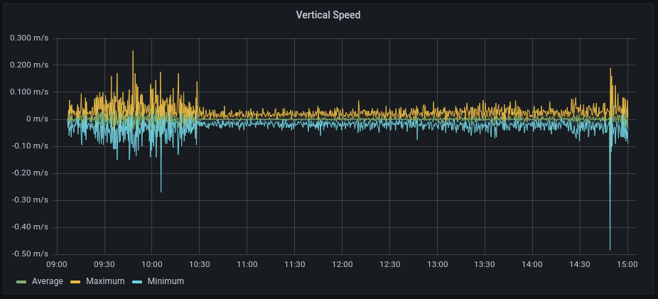

# IRIS2 telemetry scripts
You will need these scrips to show and understand the telemetry and events of the outputs produced by the IRIS 2 instrument.

## How to install
You need python3 to load the raw telemetry CSV file into an influxDB database. Grafana is used to display the telemetry. Instructions for Linux are provided.

### Commands in Linux
Install python:
```console
sudo apt install python3
```
Install pip3:
```console
sudo apt install python3-pip
```
Install influxDB python interface
```console
pip3 install influxdb
pip3 install -r requirements.txt
```
Install influxDB
```console
sudo apt-get install influxdb
sudo service influxdb start
```
Install Grafana
```console
wget -q -O - https://packages.grafana.com/gpg.key | sudo apt-key add -
sudo add-apt-repository "deb https://packages.grafana.com/oss/deb stable main"
sudo apt update
sudo apt install grafana
sudo systemctl start grafana-server
sudo systemctl status grafana-server
sudo systemctl enable grafana-server
```
Create database:
```console
influx
CREATE DATABASE db0
```

## Usage
There are 3 different scripts:
 * To load telemetry on the database.
 * To show graphs of the telemetry without database
 * To convert the events files into human readable events

### Loading telemetry to grafana
Load the CSV file into the database
```console
python3 loadFile.py 20211120_tlm.csv
```
Connect to grafana at http://localhost:3000/ Click on the "+" button and Import from JSON, use the IRIS2_dashboard.json file

Probably you need to configure the database access from the left configuration arrow, datasources, usually the default values are enough.

<div align="center">

</div>

### Converting the event log file to human readable
After dumping the event log into a CSV file, run the following command:
```console
python3 translateEvents.py 20220220_AfterTVAC_putty_events_nor.csv
```
A display as follows will appear:
```
Reading file '20220220_AfterTVAC_putty_events_nor.csv'
================================================================================
2022/03/18 16:12:11.011 (0 days 00:00:00.011): FLIGHTSTATE_DEBUG           , [0], Booting up with firmware version '9', reason was 'Brownout (BOR)'
2022/03/18 16:12:20.545 (0 days 00:00:10.545): FLIGHTSTATE_WAITFORLAUNCH   , [0], Power off detected? Current was -2mA, voltage 11.61V
2022/03/18 16:12:21.300 (0 days 00:00:10.300): FLIGHTSTATE_WAITFORLAUNCH   , [0], Power off detected? Current was -1mA, voltage 9.65V
================================================================================
2022/03/18 16:14:24.011 (0 days 00:00:00.011): FLIGHTSTATE_DEBUG           , [0], Booting up with firmware version '9', reason was 'Brownout (BOR)'
2022/03/18 16:15:37.133 (0 days 00:01:13.133): FLIGHTSTATE_WAITFORLAUNCH   , [0], Power off detected? Current was -4mA, voltage 11.24V
2022/03/18 16:15:38.419 (0 days 00:01:14.419): FLIGHTSTATE_WAITFORLAUNCH   , [0], Power off detected? Current was -5mA, voltage 9.78V
2022/03/18 16:16:26.935 (0 days 00:02:03.935): FLIGHTSTATE_WAITFORLAUNCH   , [0], Camera '0' started recording video with a duration of 7200s in 'Normal 2.7k/4:3' mode.
2022/03/18 16:16:26.937 (0 days 00:02:03.937): FLIGHTSTATE_WAITFORLAUNCH   , [0], Camera '1' started recording video with a duration of 7200s in 'Normal 2.7k/4:3' mode.
2022/03/18 16:16:26.939 (0 days 00:02:03.939): FLIGHTSTATE_WAITFORLAUNCH   , [0], Camera '2' started recording video with a duration of 3600s in 'Normal 2.7k/4:3' mode.
2022/03/18 16:16:26.941 (0 days 00:02:03.941): FLIGHTSTATE_WAITFORLAUNCH   , [0], Camera '3' started recording video with a duration of 3600s in 'Normal 2.7k/4:3' mode.
2022/03/18 16:16:26.952 (0 days 00:02:03.952): FLIGHTSTATE_WAITFORLAUNCH   , [0], Flight sequence changed to 'FLIGHTSTATE_LAUNCH' due to vertical speed over launch threshold.
2022/03/18 17:16:41.960 (0 days 01:02:18.960): FLIGHTSTATE_LAUNCH          , [0], Camera '2' ended recording video.
2022/03/18 17:16:41.969 (0 days 01:02:18.969): FLIGHTSTATE_LAUNCH          , [0], Camera '3' ended recording video.
2022/03/18 18:16:41.948 (0 days 02:02:18.948): FLIGHTSTATE_LAUNCH          , [0], Camera '0' ended recording video.
2022/03/18 18:16:41.963 (0 days 02:02:18.963): FLIGHTSTATE_LAUNCH          , [0], Camera '1' ended recording video.
2022/03/18 18:16:56.929 (0 days 02:02:33.929): FLIGHTSTATE_LAUNCH          , [0], Flight sequence changed to 'FLIGHTSTATE_TIMELAPSE'
2022/03/21 08:37:06.993 (2 days 16:22:44.993): FLIGHTSTATE_TIMELAPSE       , [0], Flight sequence changed to 'FLIGHTSTATE_LANDING' due to vertical speed higher than landing threshold.
2022/03/21 08:37:21.985 (2 days 16:22:59.985): FLIGHTSTATE_LANDING         , [0], Camera '0' started recording video with a duration of 900s in 'Normal 2.7k/4:3' mode.
2022/03/21 08:37:21.988 (2 days 16:22:59.988): FLIGHTSTATE_LANDING         , [0], Camera '1' started recording video with a duration of 3600s in 'Normal 2.7k/4:3' mode.
2022/03/21 08:37:21.990 (2 days 16:22:59.990): FLIGHTSTATE_LANDING         , [0], Camera '2' started recording video with a duration of 900s in 'HighSpeed 960p/Wide' mode.
2022/03/21 08:37:21.992 (2 days 16:22:59.992): FLIGHTSTATE_LANDING         , [0], Camera '3' started recording video with a duration of 900s in 'Normal 2.7k/4:3' mode.
2022/03/21 08:52:36.997 (2 days 16:38:14.997): FLIGHTSTATE_LANDING         , [1], Camera '0' ended recording video.
2022/03/21 08:52:37.011 (2 days 16:38:14.011): FLIGHTSTATE_LANDING         , [1], Camera '2' ended recording video.
2022/03/21 08:52:37.020 (2 days 16:38:14.020): FLIGHTSTATE_LANDING         , [1], Camera '3' ended recording video.
2022/03/21 09:02:17.134 (2 days 16:47:54.134): FLIGHTSTATE_LANDING         , [1], Camera '0' started recording video with a duration of 900s in 'Normal 2.7k/4:3' mode.
2022/03/21 09:02:17.136 (2 days 16:47:54.136): FLIGHTSTATE_LANDING         , [1], Camera '2' started recording video with a duration of 900s in 'Normal 2.7k/4:3' mode.
2022/03/21 09:02:17.138 (2 days 16:47:54.138): FLIGHTSTATE_LANDING         , [1], Camera '3' started recording video with a duration of 900s in 'Normal 2.7k/4:3' mode.
2022/03/21 09:02:17.140 (2 days 16:47:54.140): FLIGHTSTATE_LANDING         , [1], IRIS2 is below landing threshold! Measured 2984.64m.
2022/03/21 09:17:32.170 (2 days 17:03:09.170): FLIGHTSTATE_LANDING         , [2], Camera '0' ended recording video.
2022/03/21 09:17:32.179 (2 days 17:03:09.179): FLIGHTSTATE_LANDING         , [2], Camera '2' ended recording video.
2022/03/21 09:17:32.188 (2 days 17:03:09.188): FLIGHTSTATE_LANDING         , [2], Camera '3' ended recording video.
2022/03/21 09:37:37.009 (2 days 17:23:14.009): FLIGHTSTATE_LANDING         , [2], Camera '1' ended recording video.
2022/03/21 10:07:06.983 (2 days 17:52:44.983): FLIGHTSTATE_LANDING         , [2], Flight sequence changed to 'FLIGHTSTATE_TIMELAPSE_LAND'
2022/03/21 10:30:25.562 (2 days 18:16:03.562): FLIGHTSTATE_TIMELAPSE_LAND  , [0], Movement detected by Accelerometer!
2022/03/21 10:30:31.894 (2 days 18:16:09.894): FLIGHTSTATE_TIMELAPSE_LAND  , [0], Movement detected by Accelerometer!
2022/03/21 10:30:32.586 (2 days 18:16:10.586): FLIGHTSTATE_TIMELAPSE_LAND  , [0], Camera '0' started recording video with a duration of 120s in 'Normal 2.7k/4:3' mode.
2022/03/21 10:30:32.588 (2 days 18:16:10.588): FLIGHTSTATE_TIMELAPSE_LAND  , [0], Camera '1' started recording video with a duration of 120s in 'Normal 2.7k/4:3' mode.
2022/03/21 10:30:32.590 (2 days 18:16:10.590): FLIGHTSTATE_TIMELAPSE_LAND  , [0], Camera '2' started recording video with a duration of 120s in 'Normal 2.7k/4:3' mode.
2022/03/21 10:30:32.592 (2 days 18:16:10.592): FLIGHTSTATE_TIMELAPSE_LAND  , [0], Camera '3' started recording video with a duration of 120s in 'Normal 2.7k/4:3' mode.
2022/03/21 10:30:32.594 (2 days 18:16:10.594): FLIGHTSTATE_TIMELAPSE_LAND  , [0], Flight sequence changed to 'FLIGHTSTATE_RECOVERY'
2022/03/21 10:30:32.685 (2 days 18:16:10.685): FLIGHTSTATE_RECOVERY        , [0], Movement detected by Accelerometer!
2022/03/21 10:32:47.606 (2 days 18:18:25.606): FLIGHTSTATE_RECOVERY        , [0], Camera '0' ended recording video.
2022/03/21 10:32:47.615 (2 days 18:18:25.615): FLIGHTSTATE_RECOVERY        , [0], Camera '1' ended recording video.
2022/03/21 10:32:47.624 (2 days 18:18:25.624): FLIGHTSTATE_RECOVERY        , [0], Camera '2' ended recording video.
2022/03/21 10:32:47.641 (2 days 18:18:25.641): FLIGHTSTATE_RECOVERY        , [0], Camera '3' ended recording video.
2022/03/21 10:34:07.392 (2 days 18:19:44.392): FLIGHTSTATE_RECOVERY        , [0], Power off detected? Current was -24mA, voltage 7.20V
```

### Displaying graphs without grafana
> :warning: With the following two scripts you have to modify the code to display other telemetry values than those shown by default.

You can also display different graphs using mathplot and not installing grafana. After dumping the telemetry of IRIS into a CSV file do, run the following command:
```console
python3 showGraph.py 20220214_baroTest_tlm.csv
```
There is an alternative using pandas:
```console
python3 showGraphTelemetry.py 20220214_baroTest_tlm.csv
```

## Docker Alternative
I tried to install grafana and influx with docker-compose unsuccessfully due to an incorrect influxdb version. It needs a little bit of updates to make it work.

## How to delete from database
The best thing is to do as follows on a local terminal:
```console
influx
use db0
DELETE FROM /.*/ WHERE "time" >= '2022-04-12T00:00:00.0000000Z' AND "time" <= '2022-04-13T00:27:08.0000000Z'
```
